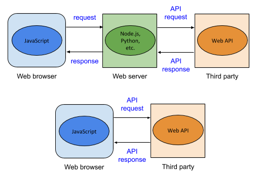
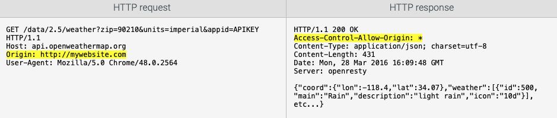

# Using third-party web APIs (JavaScript)

Many organizations have created public web APIs that provide access to the organization's data or the user's data that is stored by the organization. Ex: The Twitter API provides applications the ability to post or access a user's tweets, and the Instagram API allows applications access to photos shared on Instagram. [ProgrammableWeb](https://www.programmableweb.com/apis/directory) lists details on thousands of public web APIs, many of which are free to use.

A ***third-party web API*** is a public web API used by a web application to access data provided by a third party. "Third-party" refers to a person or organization that is neither the web application using the API nor the user using the web application, which are the "first" and "second" parties. Websites rely on third-party web APIs to integrate with social media, obtain maps and weather data, or access collections of data.

To use a third-party web API, a developer usually registers with the third party to obtain an ***API key***. Third parties require API keys for several reasons:

- The API key identifies who or what application is using the web API.
- The API key helps the third party limit the number of requests made to the API in a fixed time period or may be used to charge a developer a fee for additional requests.
- To obtain an API key, developers must agree to restrictions the third party places on data obtained from the web API.
Most third-party web APIs are RESTful. A ***RESTful web API*** is a web API that is called with a URL that specifies API parameters and returns **JSON** or **XML** containing the API data. Ex: The URL http://linkedin.com/api/article?id=123 specifies the article ID 123, so the article would be returned formatted in JSON.

Third-party web APIs may be called from the web server or the web browser. This material shows how to call web APIs from the web browser using JavaScript.



Figure 7.10.1: Calling third-party web API from the web server or web browser.

## Quick Check 1
1. Information from a third-party web API reaches the browser faster if the browser calls the web API directly instead of the web server calling the web API.
    - [x] True
    - [] False

2. For a third-party web API requiring an API key, the API key must be transmitted with every API request.
    - [x] True
    - [] False

3. When the browser makes an API request to a third-party web API, the web API key can be kept secret from prying eyes.
    - [] True
    - [x] False

4. Many web APIs charge a fee to the developer after a limited number of requests have been made in a 24-hour period.
    - [x] True
    - [] False

5. RESTful web APIs only return XML.
    - [] True
    - [x] False

## Weather API
OpenWeatherMap provides a [free Weather API](https://openweathermap.org/api) providing current weather data, forecasts, and historical data. Developers must register at openweathermap.org for an API key that must be transmitted in all API requests.

The OpenWeatherMap website provides documentation explaining how to use the Weather API using GET requests with various query string parameters. The API endpoint http://api.openweathermap.org/data/2.5/weather returns the current weather based on the following query string parameters:

- zip - Five digit US ZIP code
- units - Standard, metric, or imperial units to use for measurements like temperature and wind speed
- appid - Developer's API key

Other parameters are documented in the OpenWeatherMap website. The Weather API returns weather data in JSON format by default.

Figure 7.10.2: GET request to obtain the current weather for ZIP 90210.
http://api.openweathermap.org/data/2.5/weather?zip=90210&units=imperial&appid=APIKEY


## Try OpenWeatherMap's API in your web browser.
1. Go to https://openweathermap.org.

2. Sign up for an account to obtain an API key.

3. When your API key is ready, try the link: http://api.openweathermap.org/data/2.5/weather?zip=90210&units=imperial&appid=APIKEY to make an API request for the weather with ZIP 90210. The page should indicate an invalid API key was used.

4. Replace APIKEY in the URL's query string with your API key, and reload the web page. The JSON-encoded weather information for 90210 should be displayed.

5. Change the ZIP code in the URL's query string to your ZIP code, and reload the URL to see the weather in your ZIP code.

Take a screenshot and embed in the md:


## Quick Check 2
1. What does the Weather API return when an invalid API key is used in a request?

    - [] A blank web page
    - [] Weather for the 90210 ZIP
    - [x] An error message formatted in JSON

2. In the figure above, what does the Weather API return as the current humidity in the 90210 ZIP code?

- [] 75.61
- [x] 14
- [] 3.36

3. What "units" parameter value would make the Weather API return the temperature in Celsius?

- [] imperial
- [x] metric
- [] standard

4. Does the Weather API support finding the current weather by city name?

- [x] Yes
- [] No

## Cross-origin requests
Calling a third-party web API from the web browser requires a cross-origin HTTP request, since the web API is not hosted on the local website's web server. Two main techniques are used to make cross-origin requests:

- ***Cross-Origin Resource Sharing (CORS)*** is a W3C specification for how web browsers and web servers should communicate when making cross-origin requests.

- ***JSON with Padding (JSONP)*** is a technique to circumvent cross-origin restrictions by injecting `<script>` elements dynamically into a web page. Script elements have no cross-origin restrictions.

CORS is the more common of the two techniques and, for the web API user, the easiest to use. CORS requires the web browser to send an Origin header in a web API request to indicate the scheme and domain making the API request. If the API accepts the request, the API responds with an Access-Control-Allow-Origin header indicating the same value in the Origin request header or "*", which indicates that requests are allowed from any origin. CORS uses other headers that begin with Access-Control-* to support other interactions with the API.

CORS allows the browser to send GET, POST, PUT, and DELETE requests. JSONP limits the browser to sending only GET requests.

Making a request to the Weather API with CORS.



## Quick Check 3
1. What HTTP header must the web browser send in every CORS request?

    - [] Access-Control-Allow-Origin
    - [x] Origin
    - [] User-Agent

2. The web browser knows to send the Origin header in the HTTP request when the requested URL's domain name and the requesting script's domain name are _____.

    - [] the same
    - [x] different

3. When a third-party web API does not support CORS, what is Access-Control-Allow-Origin set to in the web API's response?

    - [] Access-Control-Allow-Origin is set to *.
    - [] Access-Control-Allow-Origin is set to the Origin value.
    - [x] Access-Control-Allow-Origin is not present.

4. Does JSONP support POST or PUT request methods?

    - [] Yes
    - [x] No

## Calling the Weather API with JavaScript.
```javascript
getWeather(90210);

function getWeather(zip) {
    // getWeather() creates a URL to request the current weather for the 90210 ZIP.
    let endpoint = "https://api.openweathermap.org/data/2.5/weather";
    let apiKey = "APIKEY"
    let queryString = "zip=" + zip + "&units=imperial&appid=" + apiKey;
    let url = endpoint + "?" + queryString;

    // The XMLHttpRequest object sends a GET request to the Weather API.
    let xhr = new XMLHttpRequest();
    xhr.addEventListener("load", responseReceivedHandler);
    xhr.responseType = "json";
    xhr.open("GET", url);
    xhr.send();
}

// OpenWeatherMap responds with JSON containing the current weather for ZIP code 90210. responseReceivedHandler() executes when the browser receives the JSON response.
function responseReceivedHandler() {
    let weatherInfo = document.getElementById("weather");
    // this.status is 200 unless the ZIP code is not found.
    if (this.status === 200) {
        // Weather information is extracted from this.response and displayed in the web page.
        weatherInfo.innerHTML =
        "<p>Current temp: " + this.response.main.temp + " &deg;F</p>" +
        "<p>Desc: " + this.response.weather[0].description + "</p>" +
        "<p>Humidity: " + this.response.main.humidity + "%</p>";
    } else {
        weatherInfo.innerHTML = "Weather data unavailable.";
    }
}
```

## Quick Check 4
1. What JavaScript variable must be modified for the web page to correctly access the Weather API?
    - [] endpoint
    - [x] apiKey
    - [] queryString

2. What JavaScript variable must be modified if the web page is to display the temperature in Celsius instead of Fahrenheit?
    - [] endpoint
    - [] apiKey
    - [x] queryString


What is the expected output for the call below?
```javascript
getWeather("test");
```
- [x] "Weather data unavailable."
- [] Temperature for "test" ZIP code.
- [] Exception is thrown.

4. According to the figure above that shows the Weather API's JSON response, what variable in `responseReceivedHandler()` contains the wind speed?

- [] this.status.speed
- [] this.response.speed
- [x] this.response.wind.speed
