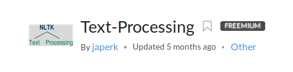
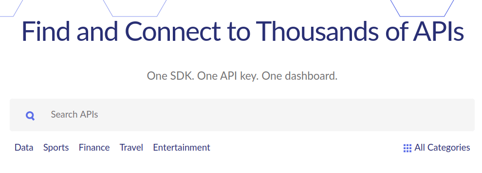
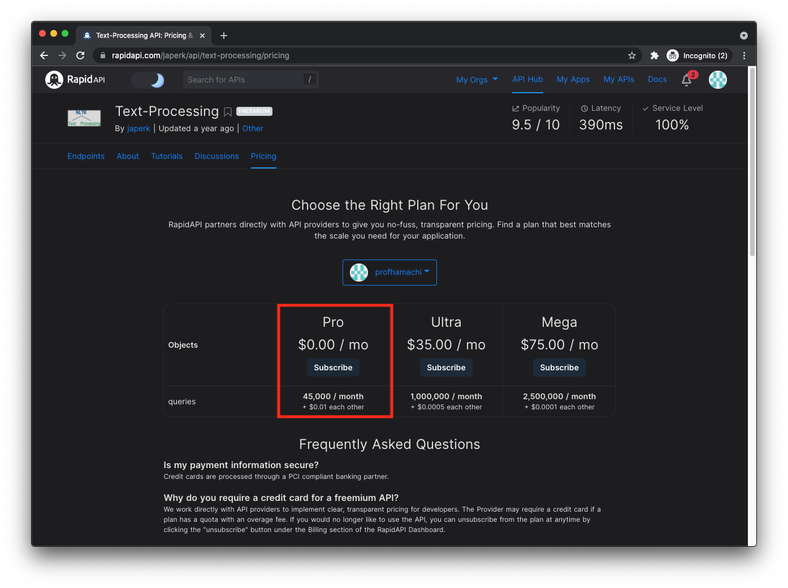
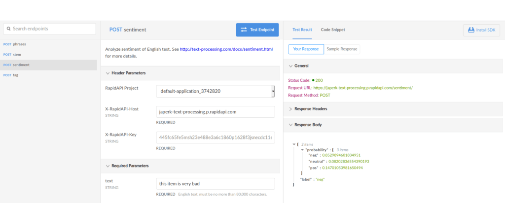
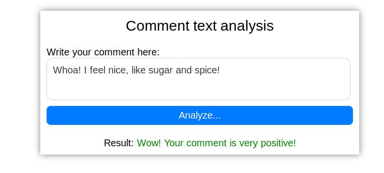

# cis193_api
 Example of How to Build a ‘Comment Sentiment Analyzer’ App with APIs & JavaScript
(adapted from https://rapidapi.com/blog/how-to-use-an-api-with-javascript/)

## Summary
Let’s imagine that we have created such a bright product that causes such a strong reaction from users that they cannot hold back emotions when they write comments. To help our users determine the nature of their feelings about the product, we will expand the usual commenting form and add functionality to analyze the sentiments of their comments.

In this task, we will be helped by Text-Processing API, which is available through the RapidAPI service. This API works under freemium conditions, allowing a limited number of texts per day to be processed for free. Since we are going to process just a few comments for test purposes, that’s enough for us.



To send requests, we will continue to use the axios library. You will also need the qs library to encode requests.

## Get your own API key
After registering with RapidAPI service (www.rapidapi.com), we will receive a service key, and this will be enough for us to start work with the Text-Processing API. You can register by clicking on the ’Sign Up’ button on RapidAPI menu.

## Navigate to the Text-Processing API page on the RapidAPI platform.

To do this, you can use the search bar, or browse the categories menu:



## Subscribe to the Text-Processing API.
To start using the API, you need to choose a suitable pricing plan. To do this, click on the *Pricing* tab and select the plan that best suits your needs. If you want to explore the API’s features first, you can subscribe to the Basic plan that provides 45,000 free requests/month, which should be more than enough for testing.



## Test the API Endpoints
To analyze the sentiment of user comments, we need the sentiment endpoint. We will test it directly in the browser by sending a negative test comment.



As we can see, API returns JSON with a negative assessment, so apparently, everything works as it should.

## Project structure
The project structure consists of three files: index.html, style.css, text-processing.js

- index.html – our HTML template
- styles.css – styles for the HTML file
- text-processing.js – JavaScript logic file

Firstly, we need the index.html in which everything will be displayed. Much of the HTML has been written for you.

Enter your name and date in the comment fields.:

Let’s break it down:

## index.html
First, we need to connect our styles in the project:

```html
<!-- Import our css styles -->
<link rel="stylesheet" href="styles.css">
```
Then, we’ll connect to the axios library for requests:

```html
<!-- Import axios library -->
<script src="https://unpkg.com/axios/dist/axios.min.js"></script>
```

And also the qs library to transform data before sending:

```html
<!-- Querystring library -->
<script src="https://cdnjs.cloudflare.com/ajax/libs/qs/6.7.0/qs.min.js"></script>
```

And then our own JS script to tie it together:

```html
<!-- Import our javascript file -->
<script src="text-processing.js"></script>
```

## styles.css
Next, let’s create some simple styling for the styles.css file:
```css
* {
  font-family: "Arial", Arial, sans-serif;
  font-weight: 400;
  padding: 0;
  margin: 0;
  border: 0;
}
body {
  padding: 20px;
  display: flex;
  justify-content: center;
  align-items: center;
}
label, textarea {
  display: block;
}
.main {
  padding: 10px;
  width: 35%;
  box-shadow: 0 0 10px rgba(0,0,0,0.5);
}
.main-header {
  text-align: center;
  margin-bottom: 20px;
}
.main-input-comment { margin-bottom: 20px; }
.main-comment-area {
  width: 95%;
  border: #ced4da 1px solid;
  border-radius: 10px;
  resize: none;
  padding: 10px;
  margin-bottom: 10px;
  font-size: 16px;
}
.main-analyze-button {
  width: 100%;
  padding: 5px;
  border: 1px solid #007bff;
  background-color: #007bff;
  border-radius: 7px;
  color: white;
  text-align: center;
  font-size: 16px;
  outline: none;
}
.main-analyze-button::-moz-focus-inner {border: 0;}
.main-analyze-button:hover {
  background-color: #0069d9;
  border-color: #0069d9;
  cursor: pointer;
}
.main-result-block { text-align: center; }
.pos { color: green; }
.neg { color: darkred; }
.neutral { color: gray }

.invisible { display: none; }
```

## text-processing.js
And finally, let’s create our JavaScript file (text-processing.js):

To begin with, let’s write constants such as the request URL and request headers (as we did before):

```javascript
// Text-Processing API Url
const API_URL = 'https://japerk-text-processing.p.rapidapi.com/sentiment/';

// RapidAPI request headers
const REQUEST_HEADERS = {
  'X-RapidAPI-Host': 'japerk-text-processing.p.rapidapi.com'
  , 'X-RapidAPI-Key': '7xxxxxxxxxxxxxxxxxxxxxxxxxxxxxxxxxx'
  , 'Content-Type': 'application/x-www-form-urlencoded'
};
```

Now we create a request based on the text entered by the user:

```javascript
const analyzeComment = (comment, callback) => {
  // Creating an object to send to the server
  const data = {
          text: comment
          , language: 'english'
  };
  // Encoding data for application/x-www-form-urlencoded content type
  const formattedData = Qs.stringify(data);
  // POST request to server
  axios.post(API_URL, formattedData, { headers: REQUEST_HEADERS })
          .then(response => {
             const data = response.data;
            // Calling a callback function with data from the server
            callback(data)
          })
          .catch(error => console.error(error))
};
```
Here ```comment``` is the text that the user entered, and ```callback``` is a function that will do something with the response from the server in the future.

In the beginning, we created the **data** object based on the API documentation. Then we translated this object into a special format *application/x-www-form-urlencoded* using the **Qs** library.

As a result, we will need to make a request like in the previous examples:

- get the result
- call the callback function
- and send to it a response from the server

Now we need a function that we can pass as a callback to the previous one, that is, a function that does something with the result, namely, it displays it to the user.

```javascript
const displayResult = result => {
  // Remove invisible class for main-result-block
  const resultBlockElement = document.getElementById('main-result-block');
  resultBlockElement.classList.remove('invisible');

  // Setting the color of the result text depending on the response label
  const label = result.label;
  const resultElement = document.getElementById('result');
  resultElement.setAttribute('class', label);
  let resultText = '';

  // Choosing the result text depending on response label
  switch (label) {
      case 'pos':
          resultText = 'Wow! Your comment is very positive!';
          break;
      case 'neg':
          resultText = 'Negative comment =(';
          break;
      case 'neutral':
          resultText = 'Simple comment =)';
          break;
      default:
          resultText = 'Hmmm, can't understand your comment';
  }

  // Setting the result text
  resultElement.textContent = resultText;
};
```
Perhaps we also need a function that will do something if the user has not entered anything and pressed the button. Here we make the result block invisible by applying the class invisible to it and display the message.

```javascript
const handleEmptyComment = () => {
  const resultBlockElement = document.getElementById('main-result-block');
  resultBlockElement.classList.add('invisible');
  return alert('Your comment is empty =(');
};
```

We also need to create a handler function that will work when a button is pressed and combine everything we wrote before:

```javascript
// Button click handler
const onAnalyzeButtonClick = () => {
  // Getting a textarea element with a comment
  const commentElement = document.getElementById('comment');
  // Getting comment text
  const commentText = commentElement.value.trim();
  // Handle empty comment
  if (!commentText) {
          return handleEmptyComment();
  }
  // Calling the API and passing the result with the displayResult as a callback function
  return analyzeComment(commentText, displayResult);
};
```

Finally, we get the following file:
```javascript
// Text-Processing API Url
const API_URL = 'https://japerk-text-processing.p.rapidapi.com/sentiment/';
// RapidAPI request headers
const REQUEST_HEADERS = {
  'X-RapidAPI-Host': 'japerk-text-processing.p.rapidapi.com'
  , 'X-RapidAPI-Key': '7xxxGETYOUROWNKEY!'
  , 'Content-Type': 'application/x-www-form-urlencoded'
};
// Button click handler
const onAnalyzeButtonClick = () => {
  // Getting a textarea element with a comment
  const commentElement = document.getElementById('comment');
  // Getting comment text
  const commentText = commentElement.value.trim();
  // Handle empty comment
  if (!commentText) {
          return handleEmptyComment();
  }
  // Calling the API and passing the result with the displayResult as a callback function
  return analyzeComment(commentText, displayResult);
};
const analyzeComment = (comment, callback) => {
  // Creating an object to send to the server
  const data = {
          text: comment
          , language: 'english'
  };
  // Encoding data for application/x-www-form-urlencoded content type
  const formattedData = Qs.stringify(data);
  // POST request to server
  axios.post(API_URL, formattedData, { headers: REQUEST_HEADERS })
          .then(response => {
            const data = response.data;
            // Calling a callback function with data from the server
            callback(data)
          })
          .catch(error => console.error(error))
};
const handleEmptyComment = () => {
  const resultBlockElement = document.getElementById('main-result-block');
  resultBlockElement.classList.add('invisible');
  return alert('Your comment is empty =(');
};
const displayResult = result => {
  // Remove invisible class for main-result-block
  const resultBlockElement = document.getElementById('main-result-block');
  resultBlockElement.classList.remove('invisible');
  // Setting the color of the result text depending on the response label
  const label = result.label;
  const resultElement = document.getElementById('result');
  resultElement.setAttribute('class', label);
  let resultText = '';
  // Choosing the result text depending on response label
  switch (label) {
      case 'pos':
          resultText = 'Wow! Your comment is very positive!';
          break;
      case 'neg':
          resultText = 'Negative comment =(';
          break;
      case 'neutral':
          resultText = 'Simple comment =)';
          break;
      default:
          resultText = 'Hmmm, can not understand your comment';
  }
  // Setting the result text
  resultElement.textContent = resultText;
};
```

Our click handler (onAnalyzeButtonClick) is already added to the button.

```html
<button class="main-analyze-button" onclick="onAnalyzeButtonClick()">Analyze...</button>
```

The app is ready! We have implemented Anger Management with Javascript, and now every user will be able to understand what emotions their comments express:


