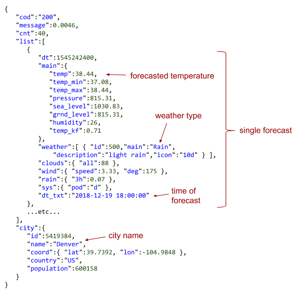

# Weather Comparison

## Weather Comparison overview
This section presents an example implementation of a Weather Comparison web app that compares the weather forecast between two cities. The OpenWeatherMap's [free 5 day weather forecast API](https://openweathermap.org/forecast5) is used to obtain weather forecasts using the XMLHttpRequest object.

The OpenWeatherMap website provides documentation explaining how to use the forecast API using GET requests with various query string parameters. The API endpoint https://api.openweathermap.org/data/2.5/forecast returns the current weather based on the following query string parameters:

- q - City name
- units - Standard, metric, or imperial units to use for measurements like temperature and wind speed
- appid - Developer's API key

Other parameters are documented in the OpenWeatherMap website. The Weather API returns weather data in JSON format by default. The JSON response contains the weather forecast for 5 days with data every 3 hours. The figure below shows the first hour's forecast for Denver in the `list`.

URL and JSON response containing Denver forecast.
```html
http://api.openweathermap.org/data/2.5/forecast?q=Denver,US&units=imperial&appid=APIKEY
```


## Quick Check 1

1. The forecast is for 6:00 pm on December 19, 2018.
- [x] True
- [] False

2. The forecast is for a clear sky.
- [] True
- [x] False

3. The forecast temperature is shown in Celsius.
- [x] True
- [] False

4. The next item in the list should be 3 hours after the currently shown list item.
- [x] True
- [] False

## Page HTML and CSS
The HTML for the page has two text inputs and a Compare button so the user can enter the two cities to compare. The 5 day forecast will be displayed below in two tables. The web page uses an external stylesheet styles.css for styling the page.

### weather.html
```html
<!DOCTYPE html>
<html lang="en">
   <meta charset="UTF-8">
   <title>Weather Comparison</title>
   <link rel="stylesheet" href="styles.css">
<!--   <script src="weather.js"></script>  -->

   <body>
      <h1>Weather Comparison</h1>
      <section id="weather-input">
         <div>
            <label for="city1">City 1:</label>
            <input type="text" id="city1">
            <span class="error-msg hidden" id="error-value-city1">Enter a city</span>
         </div>
         <div>
            <label for="city2">City 2:</label>
            <input type="text" id="city2">
            <span class="error-msg hidden" id="error-value-city2">Enter a city</span>
         </div>
         <div>
            <button id="compareBtn">Compare</button>
         </div>
      </section>
      <section id="forecast" class="hidden">
         <h2>5 Day Forecast</h2>

         <p id="loading-city1">Loading...</p>
         <p id="error-loading-city1" class="error-msg"></p>
         <table id="results-city1">
            <caption id="city1-name"></caption>
            <tr>
               <td id="city1-day1-name"></td>
               <td id="city1-day2-name"></td>
               <td id="city1-day3-name"></td>
               <td id="city1-day4-name"></td>
               <td id="city1-day5-name"></td>
            </tr>
            <tr>
               <td id="city1-day1-high"></td>
               <td id="city1-day2-high"></td>
               <td id="city1-day3-high"></td>
               <td id="city1-day4-high"></td>
               <td id="city1-day5-high"></td>
            </tr>
            <tr>
               <td id="city1-day1-low"></td>
               <td id="city1-day2-low"></td>
               <td id="city1-day3-low"></td>
               <td id="city1-day4-low"></td>
               <td id="city1-day5-low"></td>
            </tr>
            <tr>
               <td></td>
               <td></td>
               <td></td>
               <td></td>
               <td></td>
            </tr>
         </table>

         <p id="loading-city2">Loading...</p>
         <p id="error-loading-city2" class="error-msg"></p>
         <table id="results-city2">
            <caption id="city2-name"></caption>
            <tr>
               <td id="city2-day1-name"></td>
               <td id="city2-day2-name"></td>
               <td id="city2-day3-name"></td>
               <td id="city2-day4-name"></td>
               <td id="city2-day5-name"></td>
            </tr>
            <tr>
               <td id="city2-day1-high"></td>
               <td id="city2-day2-high"></td>
               <td id="city2-day3-high"></td>
               <td id="city2-day4-high"></td>
               <td id="city2-day5-high"></td>
            </tr>
            <tr>
               <td id="city2-day1-low"></td>
               <td id="city2-day2-low"></td>
               <td id="city2-day3-low"></td>
               <td id="city2-day4-low"></td>
               <td id="city2-day5-low"></td>
            </tr>
            <tr>
               <td></td>
               <td></td>
               <td></td>
               <td></td>
               <td></td>
            </tr>
         </table>
      </section>
   </body>
</html>
```

styles.css
```css
body {
   font-family: Helvetica, sans-serif;
   color: #555;
   background-color: #e6f2ff;
}

#weather-input div {
   padding-bottom: 8px;
}

.hidden {
   display: none;
}

.error-msg {
   color: red;
}

table {
   margin-bottom: 15px;
}

table caption {
   font-weight: bold;
}

table td {
   text-align: center;
   padding: 3px 8px;
}
```

## Quick Check 2
1. What CSS class is hiding the "Enter a city" messages and the forecast section?
    - [] error-msg
    - [x] hidden
    - [] display

2. What does the web page display if the hidden class is removed from an "Enter a city" `<span>`?
    - [] Nothing. The text remains hidden.
    - [] "Enter a city" under the textbox.
    - [x] "Enter a city" next to the textbox.

3. What does the web page display if the hidden class is removed from the forecast `<section>`?
    - [] Nothing. The section remains hidden.
    - [] Two empty tables.
    - [x] Two "Loading..." messages and two empty tables.

## Handling the Compare button click
When the Compare button is clicked, the JavaScript in weather.js needs to:

1. Extract the cities from the text boxes.
2. If no city is entered in a text box, display an error message next to the text box.
3. If two cities are entered, hide the error messages and show the forecast section and only the loading messages.
4. Send two HTTP requests to the forecast API requesting the forecast for the two cities.
The figure below shows some of the code necessary to implement the above logic.

### Compare button callback and supporting code.
```javascript
// Called when Comapre button is clicked
function compareBtnClick() {
   // Get user input
   const city1 = document.getElementById("city1").value.trim();
   const city2 = document.getElementById("city2").value.trim();

   // Show error messages if city fields left blank
   if (city1.length === 0) {
      showElement("error-value-city1");
   }
   if (city2.length === 0) {
      showElement("error-value-city2");
   }

   // Ensure both city names provided
   if (city1.length > 0 && city2.length > 0) {
      showElement("forecast");
      hideElement("error-loading-city1");
      hideElement("error-loading-city2");
      showElement("loading-city1");
      showText("loading-city1", `Loading ${city1}...`);
      showElement("loading-city2");
      showText("loading-city2", `Loading ${city2}...`);
      hideElement("results-city1");
      hideElement("results-city2");

      // Fetch forecasts
      getWeatherForecast(city1, "city1");
      getWeatherForecast(city2, "city2");
   }
}

// Display the text in the element
function showText(elementId, text) {
   document.getElementById(elementId).innerHTML = text;
}

// Show the element
function showElement(elementId) {
   document.getElementById(elementId).classList.remove("hidden");
}

// Hide the element
function hideElement(elementId) {
   document.getElementById(elementId).classList.add("hidden");
}
```
## Partially implemented Weather Comparison app.
Press Compare before entering a city name to see error messages. Then enter two city names and press Compare. 

The getWeatherForecast() function has not been implemented yet, so no forecasts are displayed.

weather.html
```html
<!DOCTYPE html>
<html lang="en">
   <meta charset="UTF-8">
   <title>Weather Comparison</title>
   <link rel="stylesheet" href="styles.css">
   <script src="weather.js"></script>

   <body>
      <h1>Weather Comparison</h1>
      <section id="weather-input">
         <div>
            <label for="city1">City 1:</label>
            <input type="text" id="city1">
            <span class="error-msg hidden" id="error-value-city1">Enter a city</span>
         </div>
         <div>
            <label for="city2">City 2:</label>
            <input type="text" id="city2">
            <span class="error-msg hidden" id="error-value-city2">Enter a city</span>
         </div>
         <div>
            <button id="compareBtn">Compare</button>
         </div>
      </section>
      <section id="forecast" class="hidden">
         <h2>5 Day Forecast</h2>

         <p id="loading-city1">Loading...</p>
         <p id="error-loading-city1" class="error-msg"></p>
         <table id="results-city1">
            <caption id="city1-name"></caption>
            <tr>
               <td id="city1-day1-name"></td>
               <td id="city1-day2-name"></td>
               <td id="city1-day3-name"></td>
               <td id="city1-day4-name"></td>
               <td id="city1-day5-name"></td>
            </tr>
            <tr>
               <td id="city1-day1-high"></td>
               <td id="city1-day2-high"></td>
               <td id="city1-day3-high"></td>
               <td id="city1-day4-high"></td>
               <td id="city1-day5-high"></td>
            </tr>
            <tr>
               <td id="city1-day1-low"></td>
               <td id="city1-day2-low"></td>
               <td id="city1-day3-low"></td>
               <td id="city1-day4-low"></td>
               <td id="city1-day5-low"></td>
            </tr>
            <tr>
               <td></td>
               <td></td>
               <td></td>
               <td></td>
               <td></td>
            </tr>
         </table>

         <p id="loading-city2">Loading...</p>
         <p id="error-loading-city2" class="error-msg"></p>
         <table id="results-city2">
            <caption id="city2-name"></caption>
            <tr>
               <td id="city2-day1-name"></td>
               <td id="city2-day2-name"></td>
               <td id="city2-day3-name"></td>
               <td id="city2-day4-name"></td>
               <td id="city2-day5-name"></td>
            </tr>
            <tr>
               <td id="city2-day1-high"></td>
               <td id="city2-day2-high"></td>
               <td id="city2-day3-high"></td>
               <td id="city2-day4-high"></td>
               <td id="city2-day5-high"></td>
            </tr>
            <tr>
               <td id="city2-day1-low"></td>
               <td id="city2-day2-low"></td>
               <td id="city2-day3-low"></td>
               <td id="city2-day4-low"></td>
               <td id="city2-day5-low"></td>
            </tr>
            <tr>
               <td></td>
               <td></td>
               <td></td>
               <td></td>
               <td></td>
            </tr>
         </table>
      </section>
   </body>
</html>
```

styles.css
```css
body {
   font-family: Helvetica, sans-serif;
   color: #555;
   background-color: #e6f2ff;
}

#weather-input div {
   padding-bottom: 8px;
}

.hidden {
   display: none;
}

.error-msg {
   color: red;
}

table {
   margin-bottom: 15px;
}

table caption {
   font-weight: bold;
}

table td {
   text-align: center;
   padding: 3px 8px;
}
```
weather.js
```javascript
window.addEventListener("DOMContentLoaded", domLoaded);

function domLoaded() {
   document.getElementById("compareBtn").addEventListener("click", compareBtnClick);
   document.getElementById("city1").addEventListener("input", cityInput);
   document.getElementById("city2").addEventListener("input", cityInput);
}

// Called when city input values change
function cityInput(e) {
   // Extract the text from city input that triggered the callback
   const cityId = e.target.id;
   const city = document.getElementById(cityId).value.trim();
   
   // Only show error message if no city 
   if (city.length === 0) {
      showElement("error-value-" + cityId);
   }
   else {
      hideElement("error-value-" + cityId);
   }
}

function compareBtnClick() {
   // Get user input
   const city1 = document.getElementById("city1").value.trim();
   const city2 = document.getElementById("city2").value.trim();

   // Show error messages if city fields left blank
   if (city1.length === 0) {
      showElement("error-value-city1");
   }
   if (city2.length === 0) {
      showElement("error-value-city2");
   }

   // Ensure both city names provided
   if (city1.length > 0 && city2.length > 0) {
      showElement("forecast");
      hideElement("error-loading-city1");
      hideElement("error-loading-city2");
      showElement("loading-city1");
      showText("loading-city1", `Loading ${city1}...`);
      showElement("loading-city2");
      showText("loading-city2", `Loading ${city2}...`);
      hideElement("results-city1");
      hideElement("results-city2");

      // Fetch forecasts
      getWeatherForecast(city1, "city1");
      getWeatherForecast(city2, "city2");
   }
}

// Request this city's forecast
function getWeatherForecast(city, cityId) {
   // TODO: Implement function
}

// Display the text in the element
function showText(elementId, text) {
   document.getElementById(elementId).innerHTML = text;
}

// Show the element
function showElement(elementId) {
   document.getElementById(elementId).classList.remove("hidden");
}

// Hide the element
function hideElement(elementId) {
   document.getElementById(elementId).classList.add("hidden");
}
```

## Quick Check 3
1. Only one "Enter a city" error message can appear at a time.
    - [] True
    - [x] False

2. An "Enter a city" error message appears if the user just types a few spaces.
    - [x] True
    - [] False

3. The "Enter a city" error message only disappears when the user enters a city in the text box next to the message and presses Compare again.
    - [] True
    - [x] False

4. Pressing the Compare button causes two HTTP requests to be sent to the forecast API.
- [] True
- [x] False

## Requesting the forecast

The `getWeatherForecast()` function is responsible for making an HTTP request to the forecast API. The `XMLHttpRequest` object requests creates a URL with the given city and registers a load event callback `responseReceived()`, which is called when the forecast API responds with the JSON forecast.

```javascript
// Request this city's forecast
function getWeatherForecast(city, cityId) {
   // Create a URL to access the web API
   const endpoint = "https://api.openweathermap.org/data/2.5/forecast";
   const apiKey = "Your API key goes here";
   const queryString = `q=${encodeURI(city)}&units=imperial&appid=${apiKey}`;
   const url = `${endpoint}?${queryString}`;

   // Use XMLHttpRequest to make http request to web API
   const xhr = new XMLHttpRequest();

   // Call responseReceived() when response is received 
   xhr.addEventListener("load", function () {
      responseReceived(xhr, cityId, city)
   });

   // JSON response needs to be converted into an object
   xhr.responseType = "json";

   // Send request
   xhr.open("GET", url);
   xhr.send();
}
```

## Quick Check 4
1. How is `getWeatherForecast()` properly called?
    - [] `getWeatherForecast("Denver");`
    - [] `getWeatherForecast("Denver", true);`
    - [x] `getWeatherForecast("Denver", "city1");`

2. What does the query string look like if Boston is the city?
    - [] ?q=Boston
    - [] ?q=Boston&appid=APIKEY
    - [x] ?q=Boston&units=imperial&appid=APIKEY

3. What happens if the line below is removed?

`xhr.responseType = "json";`
    - [] No request is sent.
    - [] The request is sent, but a 404 status is returned.
    - [x] The request is sent, but the JSON response is not converted into an object.

## Processing the JSON response
The `responseReceived()` function transfers the forecast information into the city's table or shows an error message if the forecast API fails to find the city's forecast. The `responseReceived()` function calls several functions:

- `getSummaryForecast()` - Retrieves a map of objects containing the day's high, low, and weather summary for 5 days.
- `getDayName()` - Converts a date like "2018-12-20" into a day name like "Thu".
- `showImage()` - Displays the weather image matching the given weather type.

###  `responseReceived()` and supporting functions.
```javascript
// Display forecast recevied from JSON  
function responseReceived(xhr, cityId, city) {
   // No longer loading
   hideElement("loading-" + cityId);

   // 200 status indicates forecast successfully received
   if (xhr.status === 200) {
      showElement("results-" + cityId);

      const cityName = xhr.response.city.name;
      showText(cityId + "-name", cityName);

      // Get 5 day forecast
      const forecast = getSummaryForecast(xhr.response.list);

      // Put forecast into the city's table
      let day = 1;
      for (const date in forecast) {
        // Only process the first 5 days
        if (day <= 5) {
           showText(`${cityId}-day${day}-name`, getDayName(date));
           showText(`${cityId}-day${day}-high`, Math.round(forecast[date].high) + "&deg;");
           showText(`${cityId}-day${day}-low`, Math.round(forecast[date].low) + "&deg;");
           showImage(`${cityId}-day${day}-image`, forecast[date].weather);
        }
        day++;
      }
   } else {
      // Display appropriate error message
      const errorId = "error-loading-" + cityId;
      showElement(errorId);
      showText(errorId, `Unable to load city "${city}".`);
   }
}

// Convert date string into Mon, Tue, etc.
function getDayName(dateStr) {
   const date = new Date(dateStr);
   return date.toLocaleDateString("en-US", { weekday: 'short', timeZone: 'UTC' });
}

// Show the weather image that matches the weatherType
function showImage(elementId, weatherType) {   
   // Images for various weather types
   const weatherImages = {
      Clear: "clear.png",
      Clouds: "clouds.png",
      Drizzle: "drizzle.png",
      Mist: "mist.png",
      Rain: "rain.png",
      Snow: "snow.png"
   };

   const imgUrl = "https://static-resources.zybooks.com/static/";
   const img = document.getElementById(elementId);
   img.src = imgUrl + weatherImages[weatherType];
   img.alt = weatherType;
}
```

The `getSummaryForecast()` function loops through the forecast data retrieved from the forecast API and creates a map of 5 or 6 objects that contain the highest and lowest temperature for each day and weather summary string like "Clear", "Rain", or "Snow".

### `getSummaryForecast()` function.
```javascript
// Return a map of objects that contain the high temp, low temp, and weather for the next 5 days
function getSummaryForecast(forecastList) {  
  // Map for storing high, low, weather
  const forecast = [];
  
  // Determine high and low for each day
  forecastList.forEach(function (item) {
     // Extract just the yyyy-mm-dd 
     const date = item.dt_txt.substr(0, 10);
     
     // Extract temperature
     const temp = item.main.temp;

      // Has this date been seen before?
     if (date in forecast) {         
        // Determine if the temperature is a new low or high
        if (temp < forecast[date].low) {
           forecast[date].low = temp;
        }
        if (temp > forecast[date].high) {
           forecast[date].high = temp;
        }
     }
     else {
        // Initialize new forecast
        const temps = {
           high: temp,
           low: temp,
           weather: item.weather[0].main
        }   
        
        // Add entry to map 
        forecast[date] = temps;
     }
  });
  
  return forecast;
}
```

Example return value:
```json
2019-01-22: {high: 43, low: 38.93, weather: "Rain"},
2019-01-23: {high: 47.02, low: 42.8, weather: "Rain"},
2019-01-24: {high: 47.44, low: 43.43, weather: "Clouds"},
2019-01-25: {high: 45.45, low: 40.39, weather: "Clouds"},
2019-01-26: {high: 42.79, low: 39.57, weather: "Clear"},
2019-01-27: {high: 41.33, low: 37.3, weather: "Clear"}
```

## Your turn!
Assemble weather.html, styles.css, and weather.js files. Make sure you use your own API key in the weather.js file.

Make sure your app works when you compare the weather for two cities.

Save, commit, and push to your github repo.
